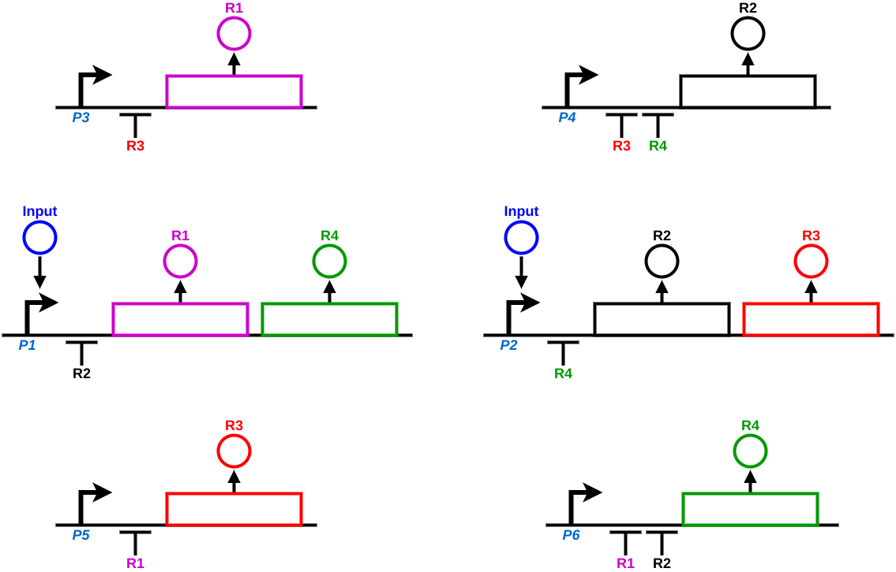

# [Re] A Multi-Functional Synthetic Gene Network

[](https://doi.org/10.5281/zenodo.3545451)

Here we replicate the work of Purcell, di Bernardo, Grierson and Savery on [A Multi-Functional Synthetic Gene Network: A Frequency Multiplier, Oscillator and Switch](https://doi.org/10.1371/journal.pone.0016140), for [ReScience](https://rescience.github.io/).




## Reproducing our work

The simulated model is implemented in Octave (tested in versions 5.2.0 and 6.2.0) and needs an additional [`signal`](https://octave.sourceforge.io/signal/) package (1.4.1) - which in turn depends on the [`control`](https://octave.sourceforge.io/control/) extension (3.2.0).
These are available in [Octave Forge](https://octave.sourceforge.io/) and can be installed directly from the **Octave command line**:

```octave
> pkg install 'https://octave.sourceforge.io/download.php?package=control-3.2.0.tar.gz'
> pkg install 'https://octave.sourceforge.io/download.php?package=signal-1.4.1.tar.gz'
```

Each experiment is configured in a separate `.mat` file following Octave's standard human-readable ASCII format.
They are named after the Figure they generate on the [replication document](article.pdf).
For the complete set of simulation settings, refer to the provided [src/save_parameters.m](src/save_parameters.m) script, which generates a sample `parameters.mat` file.
Also check out the experiment configurations inside the [src/parameters/experiments/](src/parameters/experiments/) folder for some practical examples.
The network's reaction parameters do not change and are separately loaded from [src/parameters/network.mat](src/parameters/network.mat).

To reproduce our experiments, make sure `octave` is installed and has access to the aforementioned packages, `python3` is also required.
The script [experiments.py](experiments.py) drives the execution of all simulations and figure generation, so it takes a while to complete.
It uses the `pdfcrop` command line tool to trim pdf whitespaces, so that is needed as well (albeit figure cropping is optional for the purpose of reproduction).
After all is ready, simply run:

```bash
$ python3 experiments.py
```


## Replication paper document

The [ReScience paper](article.pdf) was written on top of a [submission template](https://github.com/ReScience/template) with a [custom makefile](doc/Makefile).
Compiling this document may require several TeX packages and a working Python 3 installation:

```bash
$ cd doc
$ make
```


## Project structure

This repository is structured as follows:

```
.
├── doc                         # article sources
|   |
│   ├── img                     #   generated figures
│   │   ├── bifurcation-1a.pdf
│   │   └── ...
|   |
│   ├── Makefile                #   makefile to compile the article
│   └── ...
|
├── src                         # implementation sources
|   |
│   ├── parameters
|   |   |
│   │   ├── experiments         #   experimental settings
│   │   │   ├── fig1.mat
│   │   │   └── ...
|   |   |
│   │   └── network.mat         #   network parameters
|   |
│   ├── run_experiment.m        #   script to run a single experiment
│   └── ...
|
├── experiments.py              # runs all experiments, generates figures
├── article.pdf                 # compiled replication document
└── ...
```

### License

The replication document, its figures and sources, as well as the implementation and its sources are released under a [Creative Commons Attribution 4.0 International license](LICENSE).
This does not include the fonts inside the [doc/](doc/) folder or other parts of the original [ReScience Template](https://github.com/ReScience/template), which may be subject to different licensing terms.
